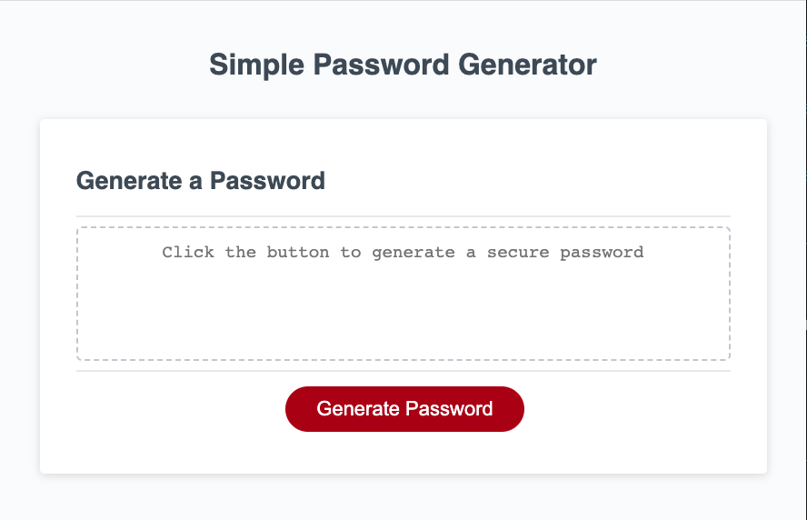
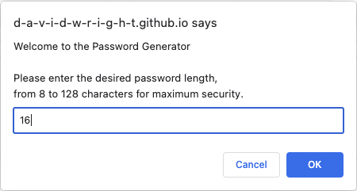
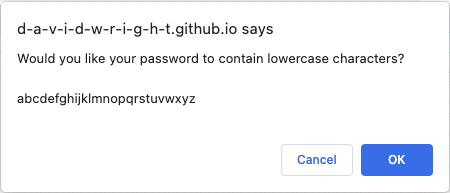
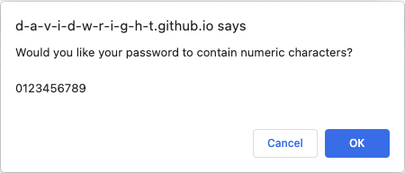
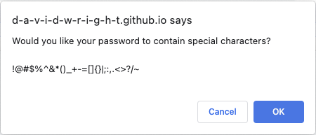
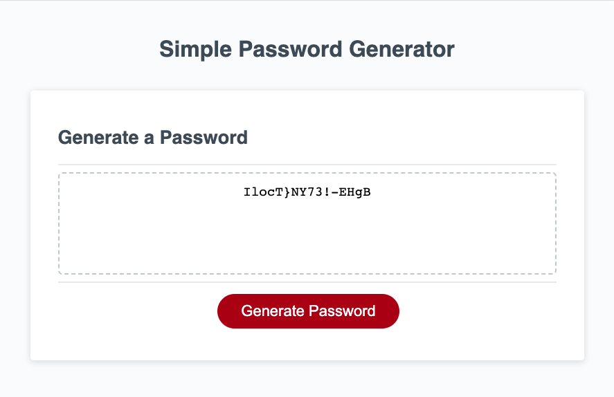
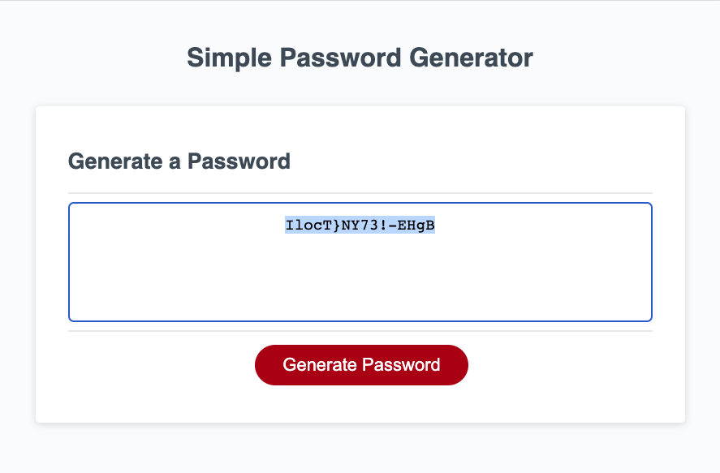

# Simple Password Generator

## Description 

Your GitHub profile is an extremely important aspect of your public identity as a developer. A well-crafted one allows you to show off your work to other developers as well as potential employers. An important component of your GitHub profile—and one that many new developers often overlook—is the README.md file.

The quality of a README often differentiates a good project from a bad project. A good one takes advantage of the opportunity to explain and showcase what your application does, justify the technologies used, and even talk about some of the challenges you faced and features you hope to implement in the future. A good README helps you stand out among the large crowd of developers putting their work on GitHub.

There's no one right way to structure a good README. There is one very wrong way, however, and that is to not include a README at all or to create a very anemic one. This guide outlines a few best practices. As you progress in your career, you will develop your own ideas about what makes a good README.

At a minimum, your project README needs a title and a short description explaining the what, why, and how. What was your motivation? Why did you build this project? (Note: The answer is not "Because it was a homework assignment.") What problem does it solve? What did you learn? What makes your project stand out? 

I deployed the application on [GitHub](https://github.com/) [Pages](https://pages.github.com/), and it can be found [here](https://d-a-v-i-d-w-r-i-g-h-t.github.io/simple-password-generator/).

## Installation

N/A

## Usage 

The Simple Password Generator  

## Credits

I learned about the viewport meta tag from [mdn web docs](https://developer.mozilla.org/en-US/), [Viewport meta tag](https://developer.mozilla.org/en-US/docs/Web/HTML/Viewport_meta_tag).

I learned about the http-equiv meta tag from [GeeksforGeeks](https://www.cdn.geeksforgeeks.org/), [What does <meta http-equiv=”X-UA-Compatible” content=”IE=edge”> do ?](https://www.geeksforgeeks.org/what-does-meta-http-equivx-ua-compatible-contentieedge-do/#).

I learned how to use the focus event to select all password text from [JavaScript in Plain English](https://javascript.plainenglish.io/), [How to Select All Contents of a Textbox When it Receives Focus?](https://javascript.plainenglish.io/how-to-select-all-contents-of-a-textbox-when-it-receives-focus-752c7469d94).

The template for this README file was provided by [edX Boot Camps](https://www.edx.org/boot-camps).

## License

Please refer to the LICENSE in the repo.

