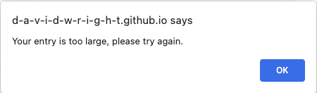
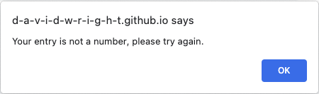
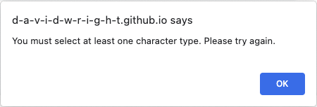

# Simple Password Generator

## Description 

For this project, I was provided with HTML and CSS files that both needed comments. I also received a 15-line JavaScript file that included a few variable declarations, a function to write the generated password to the HTML file using an ID tag, and an EventListener waiting to respond to button clicks.

With this framework, I was tasked to write a JavaScript application that would request password criteria input from the user and generate a random password of the desired length and with the desired character types. Failure modes related to input validation had to be thoroughly analyzed and addressed. I had to ensure that each desired character type would be included in the generated passwords and that the passwords would be constructed in a way that would prevent any repetitive patterns.

In completing this project, I learned more about working with strings, for-loops, and object variables. I also gained more understanding about how to access and modify web page elements using the Document Object Model. I tried to approach this development from a user's perspective. I wanted to make sure that no matter what the user did wrong, they wouldn't be able to break anything. Their mistakes would be appropriately handled in the code and they would be informed about how to avoid the mistake the next time.

The following code block shows an object variable from the application. This variable was used to contain information related to password criteria and content. For each character type there is a boolean indicating user selection, an array of characters of that type, and a string containing the character type for use in various user messages.

```js
// object variable contains user-selected password criteria, character contents, and character type
var passwordCriteria = {
lowercase: {
    inUse: false,
    content: "abcdefghijklmnopqrstuvwxyz",
    characterType: "lowercase"
},
uppercase: {
    inUse: false,
    content: "ABCDEFGHIJKLMNOPQRSTUVWXYZ",
    characterType: "uppercase"
},
numeric: {
    inUse: false,
    content: "0123456789",
    characterType: "numeric"
},
special: {
    inUse: false,
    content: "!@#$%^&*()_+-=[]{}|;:,.<>?/~",
    characterType: "special"
},
passwordLength: 0
}
```

The following function is used to extract a random character from an input string. Successive calls within a for-loop allow the password string to be extended to the desired length, one character at a time. The application uses this function with single character type arrays as its input, as well as with a concatenated string of all user-selected character types.
```js
// ** FUNCTION getRandomCharacter **
// Generate a random index based on the input string length
// Return a single random character from the input string
function getRandomCharacter(inputString) {
  var randomIndex = Math.floor(Math.random() * inputString.length);
  var randomCharacter = inputString[randomIndex];
  return randomCharacter;
}
```

Overall, I learned that careful planning and organization are vital tools when developing a complex algorithm. With a complete framework of the algorithm in pseudo-code, the translation into JavaScript (or any language) becomes much easier because the primary considerations have already been worked out.

I deployed the application on [GitHub](https://github.com/) [Pages](https://pages.github.com/), and it can be found [here](https://d-a-v-i-d-w-r-i-g-h-t.github.io/simple-password-generator/).


## Installation

N/A


## Usage 

The Simple Password Generator has a text area where the password will be displayed. It has a single red **Generage Password** button to start the application. A screenshot is provided below:


When the button is clicked, the user is presented with a Prompt Popup Box requesting a numeric input for the desired password length. Clicking **Cancel** will exit the application. Clicking **OK** will submit the input for validation.


If the user input is invalid, an Alert Popup Box will inform the user what's wrong with the input. Alerts are dismissed and the application continues when the user clicks **OK**.

This Alert indicates to the user that the input value was too large: 



This Alert indicates that the input value was too small: 


This Alert indicates that the input was not a numeric value: 



This Alert indicates that the input field was left blank: 


Once the user provides a valid password length value, the appliction then presents a series of Confirm Popup Boxes presenting the different character types that can be used in the password. Each Popup also shows a listing of all the characters  in the presented category. Clicking **OK** will select the character type for inclusion. Clicking **Cancel** will reject the character type.

With this Popup, the user can select lowercase characters:


With this Popup, the user can select uppercase characters:


With this Popup, the user can select numeric characters:


With this Popup, the user can select special characters:


If the user doesn't select any of the character types, an Alert will inform the user that they must select at least one.



After the user selects their desired character type(s), the generated password is displayed in the text area as shown below. The password will have the desired length, and it will include at least one character from each selected character type.


If the text area gets focus, either from a mouse click or by using the tab key, the password text will be automatically selected so that it can be more easily copied for subsequent use. This behavior is shown below:


Clicking the **Generate Password** button again will repeat the process and allow the user to generate another password.

The tab key cycles focus between the address bar, the text area (also selecting the password text if one has been generated), and the **Generate Password** button. Pressing the spacebar when the button has focus will also start the application.

## Credits

I learned about the viewport meta tag from [mdn web docs](https://developer.mozilla.org/en-US/), [Viewport meta tag](https://developer.mozilla.org/en-US/docs/Web/HTML/Viewport_meta_tag).

I learned about the http-equiv meta tag from [GeeksforGeeks](https://www.cdn.geeksforgeeks.org/), [What does <meta http-equiv=”X-UA-Compatible” content=”IE=edge”> do ?](https://www.geeksforgeeks.org/what-does-meta-http-equivx-ua-compatible-contentieedge-do/#).

I learned how to use the focus event to select all password text from [JavaScript in Plain English](https://javascript.plainenglish.io/), [How to Select All Contents of a Textbox When it Receives Focus?](https://javascript.plainenglish.io/how-to-select-all-contents-of-a-textbox-when-it-receives-focus-752c7469d94).

The template for this README file was provided by [edX Boot Camps](https://www.edx.org/boot-camps).


## License

Please refer to the LICENSE in the repo.

